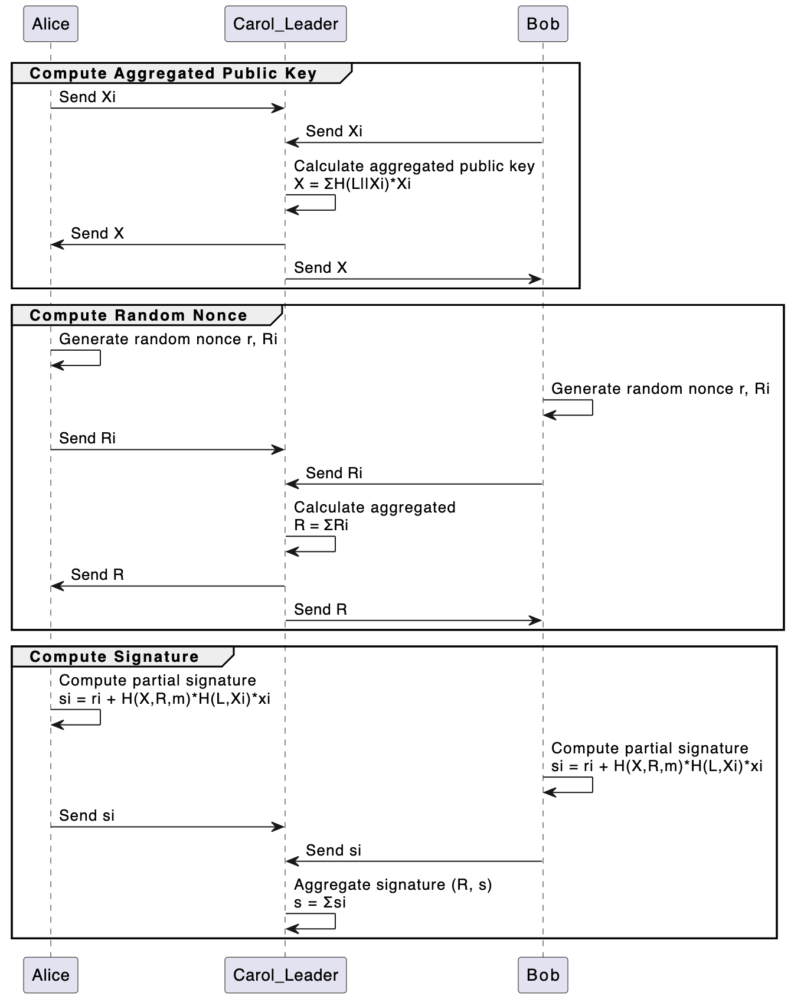

# Schnorr signature
This Rust library provides an implementation of Schnorr signatures based on the curve25519_dalek library.

## Overview of Schnorr Signatures
Schnorr signatures are a cryptographic primitive that provides a secure and efficient way to prove the authenticity of a message or transaction. They offer several advantages over other signature schemes, including compactness, resistance to side-channel attacks, and simplicity.

- Key Pair Generation: To create a Schnorr signature, user generates key pair consisting of a private key (xi) and a corresponding public key (Xi), where Xi = xi * G and G is a known generator point on the elliptic curve.
- Signing: The signing process involves user combining his private key, public key, nonce and the message to create a signature.
- Verification: The signature can be verified using the public key, public nonce and the message. If the verification equation holds, the signature is considered valid.

## Simple algorithm
### Overview
The simple Schnorr signature algorithm involves the following components:
- Private keys: x1, x2, …, with corresponding public keys X1, X2, … (where Xi = xi * G, and G is the generator point).
- Message: m
- L = H(X1, X2, …) (where H() denotes a hash function)

The equations relevant for Schnorr signatures:
- Signing: (R,s) = (rG, r + H(X,R,m)x) where r is a random nonce chosen by the signer
- Verification: sG = R + H(X,R,m)X

## MuSig algorithm
The MuSig algorithm is a variant of the Schnorr signature scheme designed for multi-party signing. It ensures that all participants agree on the final signature without revealing individual private keys.

### Overview
In the MuSig algorithm:
- n participants have private keys x1, x2, …, xn with corresponding public keys X1, X2, …, Xn.
- A message m is to be signed.
- L is calculated as L = H(X1, X2, …, Xn).
- H() represents a hash function.

### Algorithm steps
The algorithm proceeds in the following steps:
1. Participants send their public keys (Xi) to the leader. The leader then calculates the aggregated public key (X) as the sum of (H(L, Xi) * Xi) for all participants.
2. Each participant generates a new key pair (Ri = ri * G) and sends it to the leader. The leader accumulates these values to compute the common value R = sum(Ri) and shares it with all participants, along with the computed X.
3. Each signer computes their partial signature (si) as follows: si = ri + H(X, R, m) * H(L, Xi) * xi and sends it to the leader. The leader aggregates these partial signatures to form the final signature (R, s), where s is the sum of all si values.
Verification of the signature is performed using the equation s * G = R + H(X, R, m) * X.

## Usage
To use this library in your Rust project, simply include it as a dependency and refer to the provided functions and types in your code.
## Contributing
Contributions to this library are welcome! Feel free to open issues or pull requests for bug fixes, improvements, or new features.
## Acknowledgments
This library builds upon the curve25519_dalek library and is inspired by the Schnorr signature and MuSig algorithms. Thanks to the open-source community for their contributions and support.
